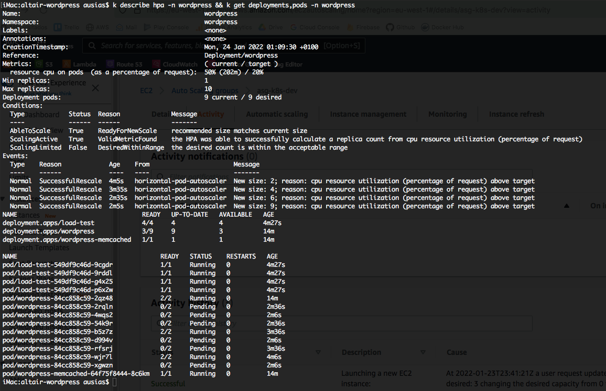
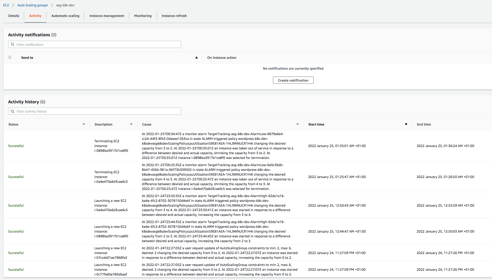

# Univerisity Chicago - Devops Course

## Assigment

Our company wants to create a marketing campaign to promote the his services. For promoting his services, they've thought to create a new Web Site which will contain the information. They have though on using Wordpress because of the expirience of the development team in that technology. They have requested you to build a new infrastructure to support the development team with the following requirements:

- Install a Wordpress server
- The Database will be MySQL 5.7 and needs to be in hosted infrastructure an not in a managed infrastructure
- Wordpress should use containerized orchestator like Kubernetes to balance high peak of workloads
- The kubernetes infrastructure should be monitored using Prometheus and Grafana
- Test that the solution will be scalable and resilient to the increase of load.
- Use an infrastructure as code approach so the whole project can be redeployed through different environments and quickly.

## Technical description

* The project is divided in 4 different repositories
  * **[uchicago-cdk](https://github.com/ausias-armesto/uchicago-cdk)**: This repository holds the CloudFormation code to create the infrastructure.
  * **[uchicago-packer](https://github.com/ausias-armesto/uchicago-packer)**: This repository holds the Packer code to generate the AWS AMI Image.
  * **[uchicago-gitops](https://github.com/ausias-armesto/uchicago-gitops)**: This repository holds the Kubernetes manifests to deploy the apps on EKS..
  * **[uchicago-wordpress](https://github.com/ausias-armesto/uchicago-wordpress)**: This repository holds the main Makefile file and the configuration to the previous repositories as Git submodules.

## Prerequisites

- Installed AWS Cli 2.2.12
- Installed AWS CDK 2.8.0
- Installed Packer 1.7.2
- Installed Kubectl v1.23.1
- Installed Fluxcd 0.28.3
- Installed kubeseal v0.17.2
- Installed yq v4.24.2

# Usage of this repository

To be able to use this repository, you need to fork it, instead of clonning
```
gh repo fork https://github.com/ausias-armesto/uchicago-wordpress --clone
cd uchicago-wordpress
git submodule init
git submodule update

```

## Asumpsions

- It exists an AWS IAM users with enough credentials to create all the required resources
- The Network has been created using default values and no taking care of applying extra security settings.
- The packer image has been created without a monitoring. 
- MySQL is using the same disk for the data than for the OS. The volume is created with deletion on the termination of the instance.
- Kubernetes cluster uses many default configurations
- Wordpress App has been installed using Helm Chart and many configurations are used by default, like storage.
- The Pipeline has not been developed as by the architecture chosen has not much sense. As the changes performed direcctly to the HelmRelease and pushed would be applied directly to the EKS Cluster.
- The Wordpress App cannot auto scale to different availability zones (3 pods with the current resource requirements) due to a conflict in persistent volume claims and their availability zones. The persistent Volume is created only for one availability zone, and I have decided not to invest time to solve this issue for the demo purposes.

## Commands

* `make check`: Cheks that the prerequisites tools are installed.
* `make prepare`: Prepares the workspace, by installed the required dependencies, build and test resources.
* `make create-secrets region=eu-west-1 env=dev`: Create secrets on AWS.
* `make deploy-network region=eu-west-1 env=dev`: Deploy the network infrastructure.
* `make create-ami region=eu-west-1 env=dev`: Deploy the MySQL packer image.
* `make deploy-infrastructure region=eu-west-1 env=dev`: Deploy the Wordpress infrastructure with the MySQL EC2 instance and a EKS Cluster.
* `make configure-kubernetes env=dev`: Configure the $HOME/.kube/config file with a new entry for the cluster created.
* `export GITHUB_TOKEN=<my-github-credentials-token>`: Export the Credentials token in an environment variable which will be used by Flux
* `make flux env=dev`: Install all the apps on the Kubernetes cluster (FluxCD, Sealed Secrets, Prometheus, Grafana, Wordpress). Change the _ghuser_ with the name of your Github forked repository user.
* `make enable-access-grafana`: Enable acces to Grafana
* `make enable-access-wordpress`: Enable acces to Wordpress
* `make load-test-start`: Starts injecting load into the wordpress App
* `make load-test-stop`: Stops injecting load into the wordpress App


## Access to Grafana:

- url: http://localhost:3000
- username: admin
- password: prom-operator


## Access to Wordpress

- url: http://localhost:4000 or http://localhost:4000/wp-admin/
- username: admin
- password: _READ FROM AWS SECRET admin-wordpress-uchicago-dev_


## Load Test

### Initialize Kubernetes

In the following image we can see how after starting the load test, the Horizontal Pod Autoscaler has move to different states increasing its size from 1 to 9.



In the AWS AutoScaling group we can see how different activity has been registered into the ASG due to the current workload which has provoked to increase the Kubernetes nodes from 2 to 6. 



