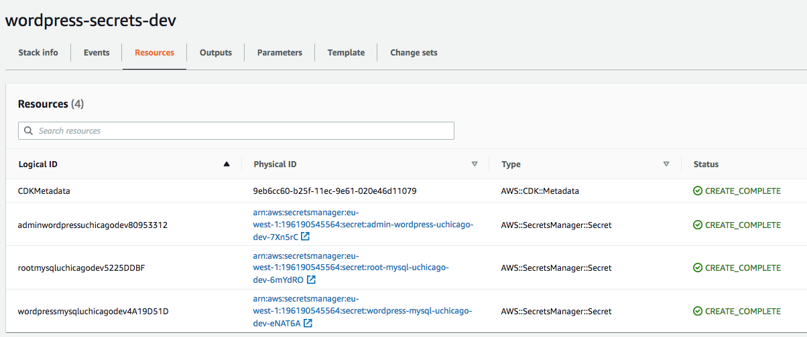

# The Univerisity of Chicago - Devops Course - Infrastructure-as-code using AWS CDK Cloudformation

## Introduction

This repository has been created as part of the contents for the [Devops Course](https://online.professional.uchicago.edu/course/dtb-dev/) at the [The Univerisity of Chicago](https://online.professional.uchicago.edu/) as an Teacher Assistant.

The purpose of this repository is to show an infrastructure-as-code example to build an example architecture consisting of a Wordpress application running on Kubernetes and using MySQL as the database engine ans EFS for sharing data the different wordpress pods.
The technology used to build the infrastructure is AWS CDK Cloudformation, because it provides a handy way to handle the creation of the AWS resources programatically and not using directly the tedious DSL format of Cloudformation.

## Important

This repository contains code that create resources on AWS that are not on the free-tier, so before executing it be aware that you will be charge for them. 

Be sure that you review that all reasources have been deleted after the removal of the Stack, as there are some resources that are not deleted automatically after deleting the Cloudformation stack. Like for example: Loadbalancer, EFS FileSystem, Security Groups.

## Prerequisites

- Installed AWS Cli 2.2.12
- Installed AWS CDK 2.8.0

## Architecture

## Commands

- `npm run clean`:  Removes generated files during compilation
- `npm run refresh`:  Regenerates the node_modules folder
- `npm run build`: Compile CDK project
- `npm run test`: Execute the Jest Unit Tests
- `npm run deploy:secrets`: Deploys the Secrets stack
- `npm run deploy:network`: Deploys the Network stack
- `npm run deploy:mysql`: Deploys the Mysql stack
- `npm run deploy:efs`: Deploys the EFS stack
- `npm run deploy:kubernetes`: Deploys the Kubernetes stack which requires the EFS stack
- `npm run deploy:infrastructure`: Deploys Mysql, EFS and Kubernetes stack
- `npm run kubernetes:config`: Updates you Kubernetes config file ($HOME/.kube/config) with the new generated cluster

## Stacks

In this section we describe the details and goals of each stack that this architecture is compose of.

### Secret stack

The secret stack is created to externalize of other cloud resources the sensible information in one single stack. This is a good practice as when the architecture evolves in the future, the resources on this stack won't be change and therefore we will easier warranty the consistency among future stack changes.

### Network stack

This stack holds all the resources required to have a simple network infrastructure on the cloud that will allow to host Mysql EC2 Instance and Kuberentes nodes on private subnets. The network topology consists of 6 subnets, 3 of them public and 3 isolated. The public and isolated subnets are in different availavility zone.
The outgoing network connectivity on the isolated subnet is done through a NAT gateway
It is important to mention that in this architecture none of the EC2 instances receibe a public IP, as they are on the isolated subnet. 

### Mysql stack

Create the EC2 Instance that will hold the Mysql enginge using the AMI generated on the [Packer repository](../uchicago-packer/). Besides creates the KeyPair needed to access the EC2 Instance and configures the Mysql server with the credentials existing on the secrets.

### EFS stack

Creates the EFS FileSystem needed by wordpress to share date among their pods and the security group to handle its access

### Kubernetes Stack

Creates the EKS Cluster, configures the kubernetes cluster by adding a storage class to be able to use EFS, and creates an autoscaling group for the worker nodes of the cluster. The autoscaling group has an automatic scaling rule configured to add more nodes, up to 6, if the CPU usage of the worker nodes exceeds 20 %.
 

